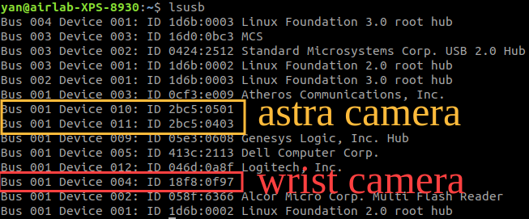
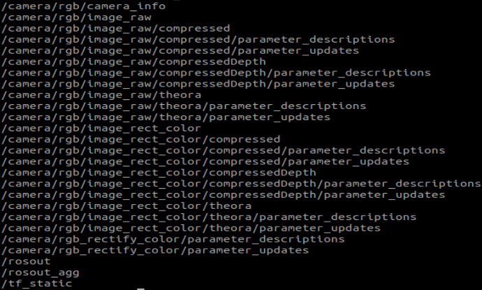
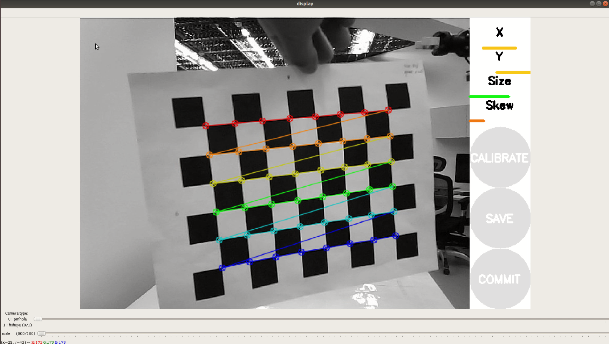
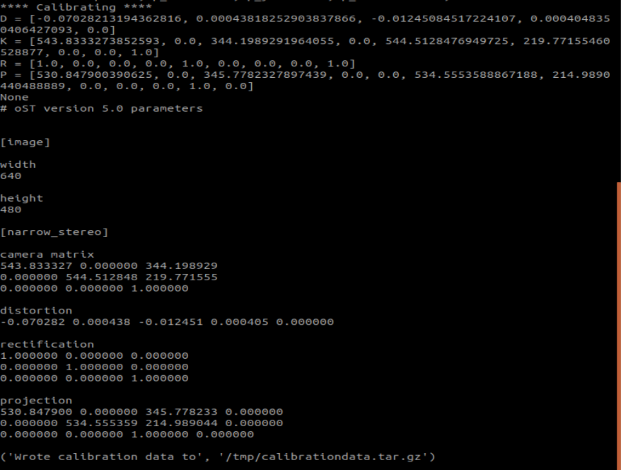

## (Option 1) Downloading Pre-calibrated Camera Information
```
cd $HOME/.ros
wget -O camera_info.tar.xz 'https://www.dropbox.com/scl/fi/s3msmxr9ithtgwdzkvo35/camera_info.tar.xz?rlkey=77xw430luhttdxrzuqhpxwlr4&dl=1'
tar -xf camera_info.tar.xz
sudo rm -rf camera_info.tar.xz
```

## (Option 2) Manual Camera Calibration
```
sudo -H apt-get install -y ros-melodic-visp-hand2eye-calibration
sudo -H apt-get install -y ros-melodic-aruco-ros
rosdep install camera_calibration
rosmake camera_calibration
```

## Checking Camera Devices
```
lsusb
```


## Activating Wrist/Astropro Camera
```
roslaunch usb_cam usb_cam_wrist.launch
```
or
```
roslaunch astra_camera astrapro.launch
```

## Checking Topic of Wrist/Astropro Camera
To check the available ROS topics for the cameras, use:
```
rostopic list
```



## Preparing a Printed Marker

Download and print the calibration marker from this
[Marker Link](../img/8_6_0025_grids.pdf '8_6_0025_grids')


## Starting Calibration of Wrist/Astropro Camera
Execute one of the following commands based on your camera setup:
```
# For USB Cam （suggested）
rosrun camera_calibration cameracalibrator.py image:=/usb_cam/image_raw camera:=/usb_cam --size 8x6 --square 0.025
```
or
```
# For RGB Camera
rosrun camera_calibration cameracalibrator.py image:=/camera/rgb/image_raw camera:=/camera/rgb --size 8x6 --square 0.025
```
or
```
# For IR Camera
rosrun camera_calibration cameracalibrator.py image:=/camera/ir/image_raw camera:=/camera/ir --size 8x6 --square 0.025
```
Note:  **size** refers to columns x rows; **square** is the side length of each square (2.5cm).



## Saving and Committing Calibration Result
```
cd ~/.ros/camera_info
ls
```


