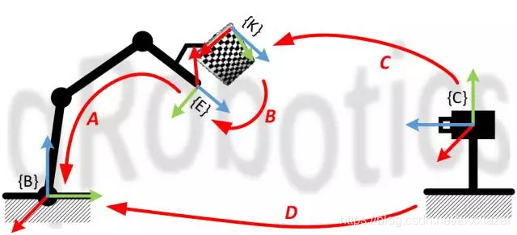
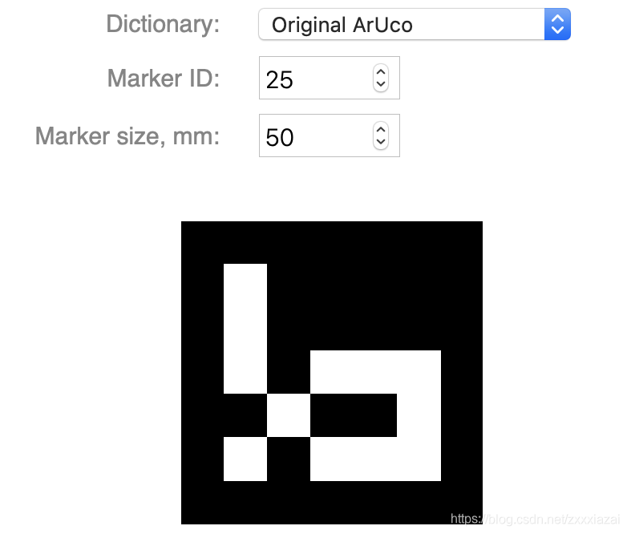
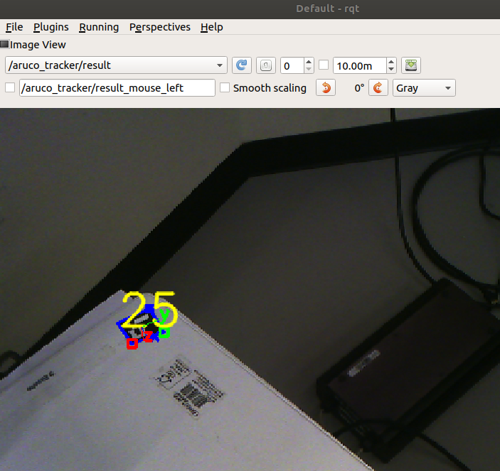
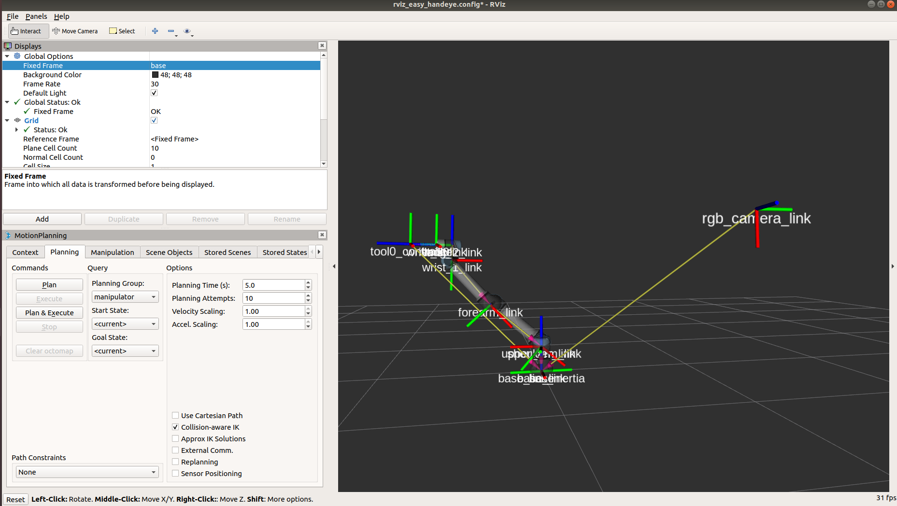
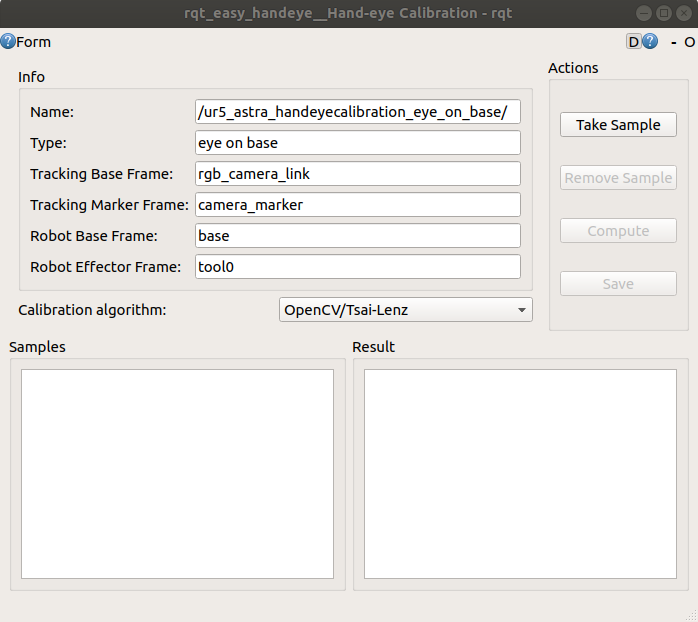
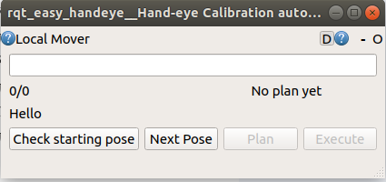

{C}：Camera frame
{B}：Robot frame
{E}：End effector frame
{K}：Marker frame

## (Option 1) Downloading Pre-Hand-Eye_Calibration
```
cd $HOME/.ros
wget -O easy_handeye.tar.xz 'https://www.dropbox.com/scl/fi/v9voms4qmgg6biv9xk25e/easy_handeye.tar.xz?rlkey=gfz3hjh5znu6gof0vuxbys15i&dl=1'
tar -xf easy_handeye.tar.xz
sudo rm -rf easy_handeye.tar.xz
```

## (Option 2) Manual Hand-Eye_Calibration

## Preparing ArUco Marker

Create a XX mm ArUco marker using one of the following links: 

[Link1](https://fodi.github.io/arucosheetgen/)

[Link2](https://chev.me/arucogen/ 'ArUco marker')

Please select "Orginal ArUco".

<p float="left">
  
</p>

## Starting Wrist Camera, ArUco, UR5e
Launch the setup using one of the following commands:

```
# For Wrist Camera Setup
roslaunch easy_handeye ur5_wrist_calibration_setup_part1.launch
```
or
```
# For Astro Camera Setup
roslaunch easy_handeye ur5_astra_calibration_setup_part1.launch
```
## Easy_handeye Calibration
Proceed with the hand-eye calibration process:
```
# For Eye-on-Hand Setup
roslaunch easy_handeye ur5_wrist_calibration_setup_eyeonhand_part2.launch
```
or
```
# For Eye-to-Hand Setup
roslaunch easy_handeye ur5_astra_calibration_setup_eyetohand_part2.launch
```
Then, start the interface:
```
rqt
```
Please select **/aruco_tracker/result**



## Starting Collection, Saving the Result

Please select **base** as the world frame. 

Collect the calibration data and visualize the process.
<p float="left">
  
  
  
</p>


## Publishing the Transformation Result
Publish the calibration result using:
```
# For Eye-on-Hand Calibration
roslaunch easy_handeye publish.launch eye_on_hand:=true namespace_prefix:=ur5_wrist_handeyecalibration
```
or
```
# For Eye-to-Hand Calibration
roslaunch easy_handeye publish.launch eye_on_hand:=false namespace_prefix:=ur5_astra_handeyecalibration
```

## Checking the Transformation Between Two Frames
To verify the transformation, use:
```
rosrun tf tf_echo /tool0_controller /rgb_camera_link
```
