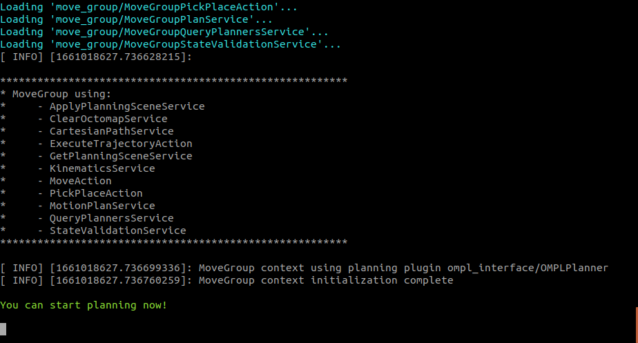
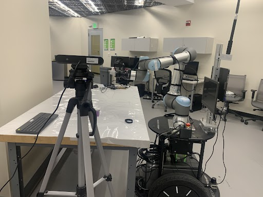
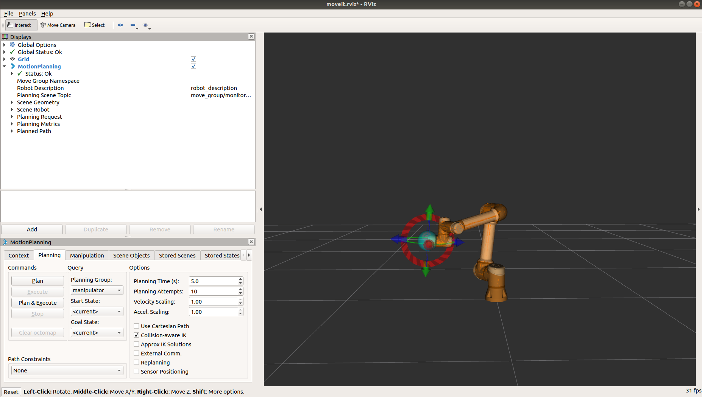

## Method 1: execute commands one by one
Open a new terminal, and input
```
roslaunch ur_robot_driver ur5e_bringup.launch limited:=true robot_ip:=10.66.171.1
```
On the teaching board, **load** external_control_yan.urp, and **run** it.


If it runs successfully, you will see the following information on the terminal:
```
[ INFO] [1615715907.527568874]: Robot requested program
[ INFO] [1615715907.527840385]: Sent program to robot
[ INFO] [1615715907.564855461]: Robot ready to receive control commands.
```

Open a new terminal, and input
```
roslaunch ur5e_moveit_config ur5e_moveit_planning_execution.launch limited:=true
```



Open a new terminal, and input
```
roslaunch ur5e_moveit_config moveit_rviz.launch rviz_config:=$(rospack find ur5_moveit_config)/launch/moveit.rviz
```

<p float="left">
  
  
</p>

Now, you can manipulate UR5e arm usuing RVIZ.

## Method 2: execute lauch file
```
roslaunch ur5_yan ur5_move.launch
```

On the teaching board, **load** external_control_yan.urp, and **run** it.

### Manipulate UR5e using Python
```
python /home/yan/catkin_ws/src/ur5_yan/scripts/ur5_move_node.py
```