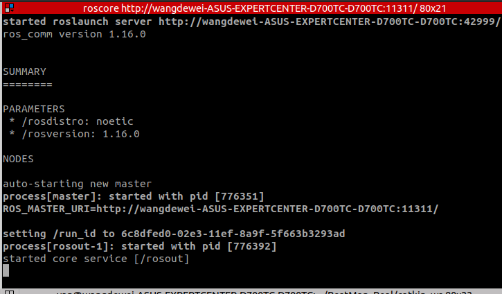

# 💻 ROS Installation Guide (Ubuntu 20.04)

## Table of Contents
- [Installation Requirements](#installation-requirements)
- [Installing ROS](#installing-ros)
- [Testing Installation](#testing-installation)
- [Additional Setup](#additional-setup)
- [Troubleshooting](#troubleshooting)

## Installation Requirements
Ensure you're running Ubuntu 20.04 for compatibility with this guide.

## Installing ROS

### Step 1: Clone Repository

Clone and set up the necessary submodules:

```
git clone https://github.com/yding25/BestMan_Real.git -b arm
cd $HOME/BestMan_Real
git submodule init
git submodule update
```
### Step 2: Install ROS Noetic

Run the installation script with the necessary permissions:

```
chmod 777 $HOME/BestMan_Real/install/ros/install_ros_noetic.sh
bash $HOME/BestMan_Real/install/ros/install_ros_noetic.sh
```

### Testing Installation

Start ROS core to verify installation:

```
roscore
```

If ROS is set up correctly, you should see the following output:



### Additional Setup

#### Install Dependencies

Ensure all dependencies are correctly installed:

```
chmod 777 $HOME/BestMan_Real/install/ros/install_dependencies.sh
bash $HOME/BestMan_Real/install/ros/install_dependencies.sh
```

### Initialize catkin_ws

Set up your workspace:

```
mkdir -p $HOME/BestMan_Real/catkin_ws/src
cd $HOME/BestMan_Real/catkin_ws
catkin_make
echo "source $HOME/BestMan_Real/catkin_ws/devel/Set up.bash" >> $HOME/.bashrc
source $HOME/.bashrc
```

### Troubleshooting

:warning: If you encounter any errors related to missing dependencies, try reinstalling all required dependencies and verify your environment setup.
