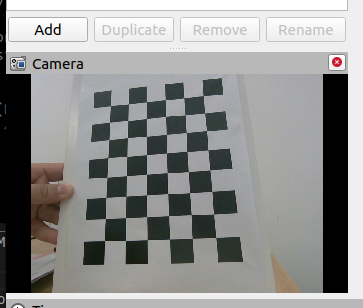
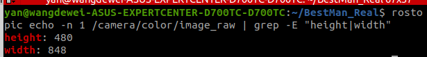

# 💻 Set Up Realsense D405 Camera

## Table of Contents
- [Introduction](#introduction)
- [Installation Steps](#installation-steps)
  - [Install Realsense ROS Package](#install-realsense-ros-package)
  - [Install Realsense Library](#install-realsense-library)
- [Testing the Camera](#testing-the-camera)
- [Troubleshooting](#troubleshooting)

## Introduction
This guide provides instructions for setting up the Realsense D405 camera on your system. Ensure your environment is prepared for ROS and camera integration.

## Installation Steps

### Install Realsense ROS Package

Run the following script to install the necessary Realsense libraries:

```
cd $HOME/BestMan_Real/catkin_ws/src
git clone https://github.com/rjwb1/realsense-ros.git
cd $HOME/BestMan_Real/catkin_ws
catkin_make
```

### Install Realsense Library

Launch ROS and Rviz to test the Realsense camera setup:

```
chmod 777 $HOME/BestMan_Real/install/camera/install_librealsense.sh
bash $HOME/BestMan_Real/install/camera/install_librealsense.sh
```

### Testing the Camera

- Method 1:
```
roslaunch realsense2_camera rs_aligned_depth.launch
rosrun rviz rviz -d $HOME/BestMan_Real/install/camera/realsense_view.rviz
```

If everything is set up correctly, you should see the following output, confirming that Realsense is functioning properly:



- Method 2:
```
roslaunch realsense2_camera rs_camera.launch
rosrun rqt_image_view rqt_image_view
```

Get height and width
```
rostopic echo -n 1 /camera/color/image_raw | grep -E "height|width"
```


### Troubleshooting

Encounter any issues? Make sure all dependencies are correctly installed and that your ROS environment is properly configured.