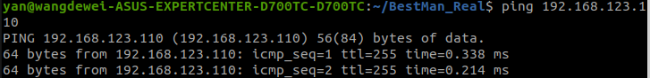
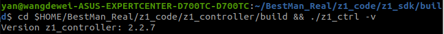
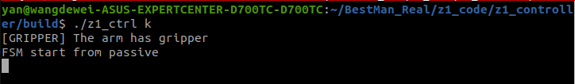
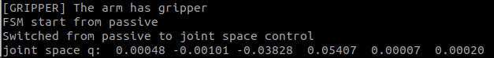
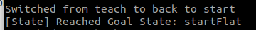
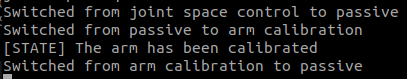

# 💻 Set Up Z1 Arm

## Overview
This document provides instructions for setting up and testing the Z1 Arm. Ensure you follow each step carefully to ensure proper functionality.

## Quick Links
- [Official Setup Instructions](https://dev-z1.cn.unitree.com/)

## Setup Process

### Set Up z1_controller

Compile and build the z1_controller software:

```
cd $HOME/BestMan_Real/z1_code/z1_controller
mkdir build
cd build
cmake ..
make
```

## Set up z1_sdk

Compile and build the z1_sdk:

```
cd $HOME/BestMan_Real/z1_code/z1_sdk
mkdir build
cd build
cmake ..
make
```

## Test Z1 Arm

### Test Network Connection
Verify the network connection to the Z1 arm:

```
ping 192.168.123.110
```




## Check Controller Version

Display the version of the controller software:

```
cd $HOME/BestMan_Real/z1_code/z1_controller/build && ./z1_ctrl -v
```



## Control Z1 Using Keyboard

Control the Z1 using keyboard commands:

```
cd $HOME/BestMan_Real/z1_code/z1_controller/build && ./z1_ctrl k
```




## Move to Forward State

Command the Z1 to move forward:

```
cd $HOME/BestMan_Real/z1_code/z1_controller/build && ./z1_ctrl k
Input '2' # joint control mode
```



## Start Flat State

Initiate the flat state:

```
Input '~' # back to flat start
```




## Calibration

Calibrate the Z1 arm if it cannot return to a flat state:

```
Input '1' # passive state
Input '=' # calibration
```



## Control Arm with Python Code

Control the Z1 arm using a Python script:

```
python3 $HOME/BestMan_Real/z1_code/z1_sdk/examples_py/example_highcmd.py
```

## Additional Resources

[Demonstration Video](https://space.bilibili.com/1442391471/channel/collectiondetail?sid=700749&spm_id_from=333.788.0.0)

## Note

Ensure that the Z1 arm is powered on and properly configured before performing these tests.